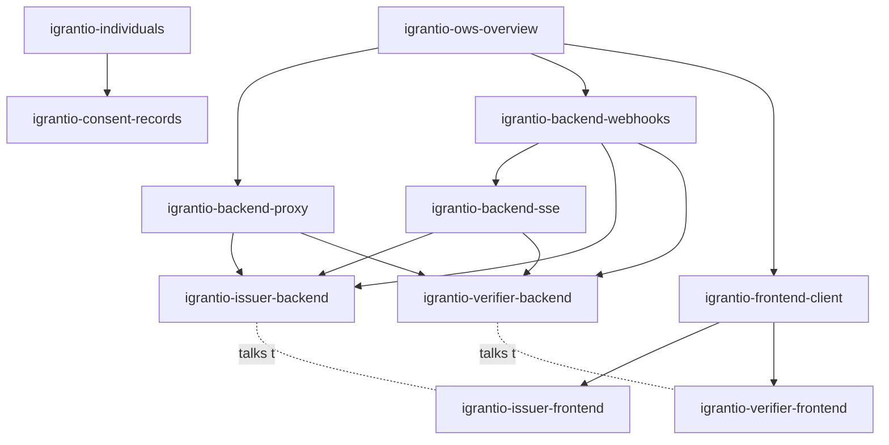

# iGrant.io Agent Skills for EUDI Wallet and European Business Wallet integrations

[](https://skills.sh/L3-iGrant/skills)
[](./LICENSE)

[Agent Skills](https://agentskills.io) that teach AI coding agents (Claude Code,
Cursor, and any agent supporting the `SKILL.md` format) how to build
**European Digital Identity (EUDI) Wallet** and **European Business Wallet**
integrations on the [iGrant.io](https://igrant.io) **Organisation Wallet Suite
(OWS)** and **Consent Building Block**:

- **Credential issuance** using OpenID4VCI 1.0 (in-time and deferred)
- **Credential verification** using OpenID4VP 1.0 + DCQL, including the same-device Digital Credentials API
- **Consent management** for recording and managing individual consents against data agreements

Credential formats and standards covered: SD-JWT VC, W3C VC 2.0, mso_mdoc, and
webhook/SSE patterns for wallet interactions under eIDAS 2.0
(EU Regulation 2024/1183).

> [!NOTE]
> Each skill is versioned individually through the `metadata.version` field in
> its `SKILL.md`, and versions are bumped whenever a skill's contract changes.
> Re-run the install command to pick up updates.

## Quick start

```bash
npx skills add L3-iGrant/skills
```

The command lets you pick which skills to install. Then just tell your agent
what to build:

> *"Using the igrantio skills, build me an OpenID4VCI issuer backend with
> per-tenant API keys, and a React frontend that shows the credential-offer QR
> and updates live when the wallet accepts."*

> *"Add verifiable-presentation verification (OpenID4VP + DCQL) to my Express
> app using the igrantio verifier skills."*

> *"Onboard my users into the Consent Building Block and add allow/withdraw
> consent handling with the igrantio consent skills."*

**Prerequisites:** an iGrant.io organisation account and API key. See
[get started](https://docs.igrant.io/docs/get-started/) and the
[developer APIs](https://docs.igrant.io/docs/developer-apis).

## Available skills

Start with the overview skill. The issuer and verifier skills compose the
building blocks, so your agent installs only what the task needs.

<!-- BEGIN SKILLS -->
| Skill | What it teaches the agent | Builds on |
| --- | --- | --- |
| [`igrantio-ows-overview`](./skills/ows/igrantio-ows-overview) | OWS architecture, glossary, and the full API reference. Read first | none |
| [`igrantio-issuer-backend`](./skills/ows/igrantio-issuer-backend) | Tenant backend for credential **issuance** (proxy + webhooks + SSE) | proxy, webhooks, sse |
| [`igrantio-issuer-frontend`](./skills/ows/igrantio-issuer-frontend) | Issuer UI: request issuance, render the QR or deep link, live status | frontend-client |
| [`igrantio-verifier-backend`](./skills/ows/igrantio-verifier-backend) | Tenant backend for **verification** (proxy + webhooks + SSE) | proxy, webhooks, sse |
| [`igrantio-verifier-frontend`](./skills/ows/igrantio-verifier-frontend) | Verifier UI: presentation request, QR or DC API, disclosed claims | frontend-client |
| [`igrantio-backend-proxy`](./skills/ows/igrantio-backend-proxy) | API-key-hiding, multi-tenant reverse proxy building block | overview |
| [`igrantio-backend-webhooks`](./skills/ows/igrantio-backend-webhooks) | Register, receive, and HMAC-verify OWS webhooks | overview |
| [`igrantio-backend-sse`](./skills/ows/igrantio-backend-sse) | Stream webhook events to the browser over SSE | webhooks |
| [`igrantio-frontend-client`](./skills/ows/igrantio-frontend-client) | Dependency-free typed OWS browser client plus React hooks | overview |
| [`igrantio-individuals`](./skills/consent/igrantio-individuals) | Onboard users as Consent BB individuals (userId to individualId mapping) | none |
| [`igrantio-consent-records`](./skills/consent/igrantio-consent-records) | Record, read, withdraw, and erase consents | individuals |
<!-- END SKILLS -->

### How the skills compose



Every skill ships a runnable TypeScript reference implementation in its
`references/` folder, so the agent adapts working code rather than generating
an integration from scratch.

## Support

Search existing issues or open a new one in the
[GitHub issue tracker](https://github.com/L3-iGrant/skills/issues). For product
questions, see the [iGrant.io documentation](https://docs.igrant.io).

## Contributing

We welcome contributions to improve these skills. You can help by:

- [Reporting bugs or inaccuracies](https://github.com/L3-iGrant/skills/issues)
  in the skill Markdown files or reference implementations.
- Suggesting new skills to add to this repository (for example, holder-side
  functions or additional iGrant.io recipes) by filing a feature request.

## Licence

Apache 2.0. You are free to copy, modify, and distribute these skills. See
[`LICENSE`](./LICENSE).
